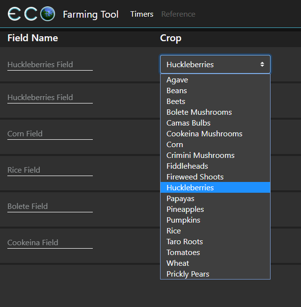
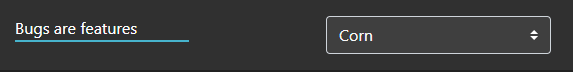
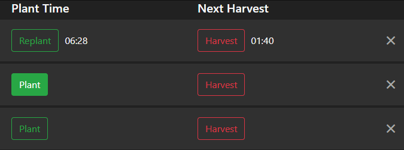
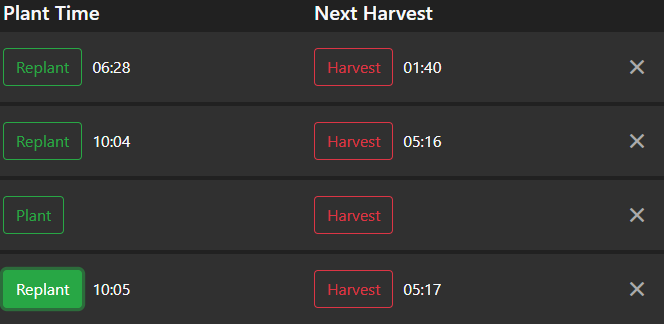

# Eco Farming Tool
This tool allows you to track farming field timers in the game Eco Global Survival. It is fairly self explanatory.

1. Choose the crop you are planting with the dropdown.

2. Set a name for the field if you'd like, though this is optional.

3. When you have the field planted in game, click the Plant button. This will populate the plant time and next harvest time based on your current system time.

4. After you have harvested the field, you can click harvest to clear the times for most crops.

> Some crops (Huckleberries, Tomatoes, & Prickly Pears) are not removed upon harvesting. For these crops, clicking the harvest button will reset the plant time to the current time, update the new growth duration, which is half the original duration, and update the new harvest time to the correct value.

5. Once you have replanted the field, click Plant or Replant to set the new Plant time to the current system time.
